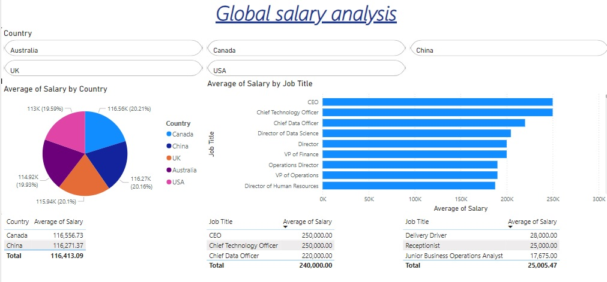
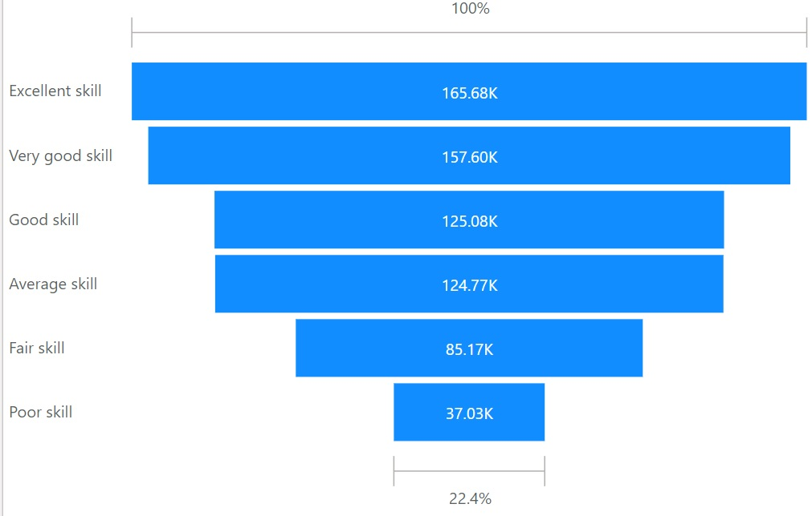

# Global-salary-analysis

## Problem Statement 
This report critically scrutinises and breaks down global salaries using the data provided. It does this by highlighting trends, disparities and factors that influence salaries across various countries.

The core areas of analysis include: geographical comparison, industry comparison, experience level comparison, educational level comparison, skill set comparison and race comparison.

## Cleaning Process
1. Geographical comparison: Compare salaries across various countries and regions
(Requirement: Obtain values of average salaries for each country. Take note of the highest and lowest 2 values by average salary)

2. A pie chart was inserted to represent average salary (values) by country (legend);
Two tables were inserted below the chart after filtering for:

3 ** Top 2 countries by average salary **- 
Canada (116,556.73)
China (116,271.37)

ii.) Bottom 2 countries by average salary -
Australia (114,917.38)
USA (112,995.49)

2. Industry comparison: Analyze salary differences across different industries
Requirement: Obtain values of average salary by job title. Take note of the highest and lowest 3 values by average salary
---

## Visualisation 

---

## Executive Summary 
- Highlight _
This report critically scrutinises and breaks down global salaries using the data provided. It does this by highlighting trends, disparities and factors that influence salaries across various countries.
The core areas of analysis include: geographical comparison, industry comparison, experience level comparison, educational level comparison, skill set comparison and race comparison.
The observations made are channelled to provide a simplistic guide to individuals and firms trying to make informed decisions concerning career paths and salaries. It goes a step further to identify the best country for a business analyst with 5 years of experience.

_ Observations _

1.) Geographical comparison impact 😄
Looking at the results of the data, there is a clear disparity in existence in salary grades in different regions. Countries holding the top position have higher salary averages than countries holding the bottom position. This is indicative of a higher demand for skilled workers than their counterparts. It also means that such countries' economies are doing well overall (higher disposable income for consumer spending, increased standard of living). Although some negative implications may also exist (rise in the price of goods and services, rise in the cost of doing business),
Lower-earning countries on the other hand have the opposite effect at play reflecting economic hardship and lower demand for skilled workers. 

